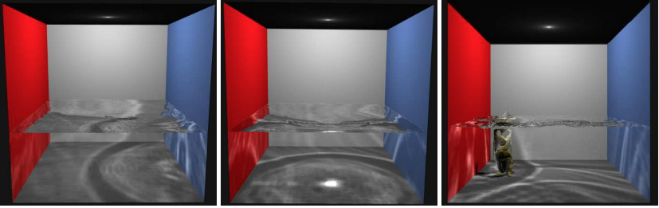

## Overview
In this project we are hoping to render various optical effects caused by light reflecting, refracting, and scattering through water. These effects include shafts of light, caustics on the physical objects within the water, and light scattering caused by particles within the water. 

## Team 
- Anthony Patitucci (3032735123, apatitucci1@berkeley.edu, anthonypat)
- Charlie Zhang (3032647334, eucbital@berkeley.edu, chfzhang)
- Dani Swords (3032906658, daniswords@berkeley.edu, daniswords)
- Rahul Desai (3033650897, rahuldesai@berkeley.edu, rahuldesai1)

## Problem Description 
We want to solve the problem of realistically rendering scenes involving bodies of water. Such scenes often occur in movies, games, and simulations. Accurate lighting effects are an essential part of making the water in these scenes appear convincing to the viewer. It is challenging because light can scatter or be absorbed randomly as it hits particles in the water and we have to be able to model that accurately and efficiently. In games it is essential that this rendering can occur in real-time while still looking realistic. 
Our final project will be based off of the skeleton code of project 3-2. We will treat the water as its own material and model the way light reflects and refracts off the water when it enters/exits using physics/optics. We also plan on modifying the path tracing algorithm to simulate the scattering/absorption of light as it travels through the water. If there is time, we can attempt to write shaders for real-time rendering of water.

## Goals and Deliverables
Our primary goal is to model caustics, which are the result of light rays reflecting and refracting from a curved surface. Ideally, by the end of the project, we will be able to render something that looks similar to this:

- Source: http://graphics.cs.ucf.edu/old/caustics/caustics.pdf
 
Our main goal is that it’s clear to any outsider who is not familiar with the class that we are modeling water based upon our rendered images. It is also important that our renderings have a reasonable runtime, comparable to what we’ve been expected to achieve in previous projects. One of our reach goals is to achieve real time rendering, and to achieve results more comparable to those we’ve found in research papers (which include more complicated underwater optical effects). 

More concretely: 
- We plan to deliver a few realistic renderings of underwater scenes with caustics and shafts of light. These renderings will include a scene with empty water as well as a scene with an object (such as a teapot) submerged under the water. As mentioned above, if shown to an average person, they would be able to recognize our scene as filled with water.
- (If time permits) We hope to deliver more optimized code for real-time renderings with a graph charting performance speedups. We also hope to provide renderings with more optical effects underwater, such as changing the visibility or type of water (clear water, river water, ocean water, etc) by changing the ppm.

We think we can accomplish these goals because we have already found several resources that will be very helpful on top of the knowledge we’ve gained from past projects.  We feel confident that we will achieve our plan, and hope that we can achieve our extra ideas if time permits.

## Schedule
#### Week 1: (Research Phase)
- Get a better understand of the physics of various underwater optical effects
- Survey different methods of rendering caustics underwater and choose a method to implement
- Design Doc + Division of Labor
 
#### Week 2: (Begin Coding)
- Start writing code
- Have the extra classes/skeleton code we need to add on top of the project 3 implemention
- Hopefully be able to render some kind of scene with water that’s presentable for the check-in
 
#### Week 3: (Finish Coding)
- Finish coding and debugging
- Start working on implementing shafts of light
 
#### Week 4: (Write up and Polish)
- Write up
- Work on stretch goals if time permits

## Resources 
Main resources:
- Basic plan: https://developer.nvidia.com/gpugems/gpugems/part-i-natural-effects/chapter-2-rendering-water-caustics 
- Real time: http://graphics.cs.ucf.edu/old/caustics/caustics.pdf
- http://nishitalab.org/user/nis/cdrom/cgi/cgf.pdf
Extra resources:
- A brief overview of underwater rendering effects: https://visl.technion.ac.il/projects/2004s18/
- https://www.researchgate.net/publication/4270546_A_simple_and_quick_method_for_rendering_underwater_optical_effect 
- Volumetric Scattering Resources: (from the spec) 
  - https://cseweb.ucsd.edu/~ravir/papers/singlescat/scattering.pdf
  - http://luthuli.cs.uiuc.edu/~daf/courses/rendering/papers/lafortune96rendering.pdf
  - https://www.cs.dartmouth.edu/~wjarosz/publications/dissertation/chapter4.pdf
- https://graphics.stanford.edu/courses/cs348b-competition/cs348b-16/second_report.pdf

